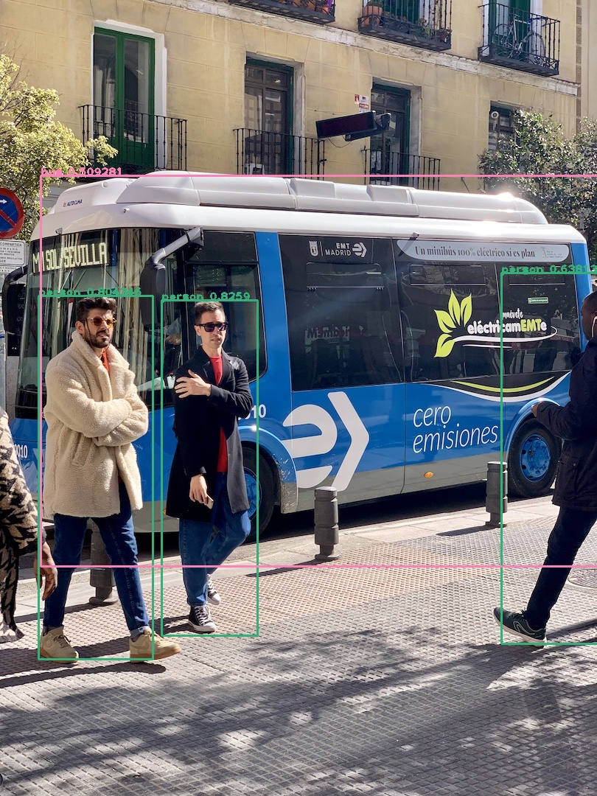
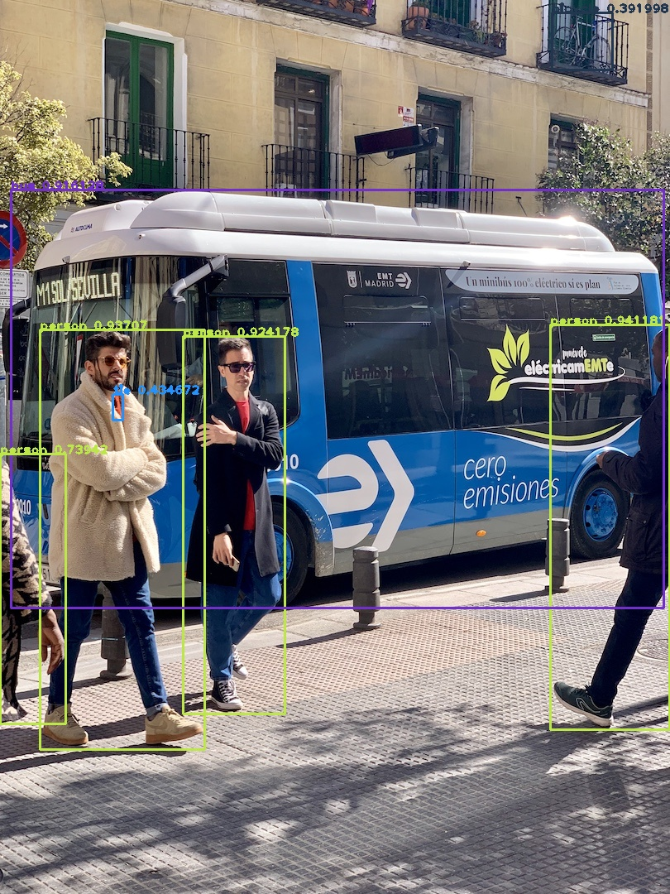
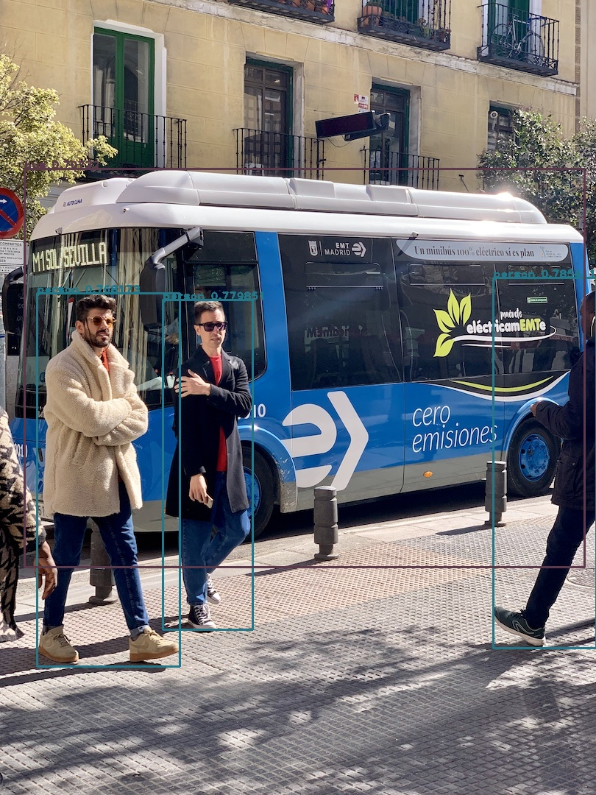

## YoloV5

1. 项目地址: [https://github.com/ultralytics/yolov5](https://github.com/ultralytics/yolov5)
2. 模型下载：[yolov5n](https://github.com/ultralytics/yolov5/releases/download/v7.0/yolov5n.pt)
3. 导出命令：

    ```shell
    # CPU
    python export.py --weights yolov5n.pt
    # CUDA 0
    python export.py --weights yolov5n.pt --device 0
    ```

## YoloV6

1. 项目地址：[https://github.com/meituan/YOLOv6](https://github.com/meituan/YOLOv6)
2. 模型下载：[YOLOv6-N](https://github.com/meituan/YOLOv6/releases/download/0.4.0/yolov6n.pt)
3. 导出命令：

    ```shell
    # CPU
    python deploy/NCNN/export_torchscript.py --weights yolov6n.pt --img-size 640 640 --device cpu
    # CUDA 0
    python deploy/NCNN/export_torchscript.py --weights yolov6n.pt --img-size 640 640 --device 0
    ```

## YoloV7

1. 项目地址：[https://github.com/WongKinYiu/yolov7](https://github.com/WongKinYiu/yolov7)
2. 模型下载：[YOLOv7](https://github.com/WongKinYiu/yolov7/releases/download/v0.1/yolov7.pt)
3. 导出命令：

    ```shell
    # CPU
    python export.py --weights yolov7.pt --grid
    # CUDA 0
    python export.py --weights yolov7.pt --grid --device 0
    ```

## YoloV8

1. 项目地址：[https://github.com/ultralytics/ultralytics](https://github.com/ultralytics/ultralytics)
2. 模型下载：[YOLOv8n](https://github.com/ultralytics/assets/releases/download/v0.0.0/yolov8n.pt)
3. 导出命令：

    ```shell
    # 下载 ultralytics
    pip install ultralytics
    # CPU
    yolo export model=yolov8n.pt format=torchscript
    # CUDA 0
    yolo export model=yolov8n.pt format=torchscript --device 0
    ```

## 测试

> `-i`：输入数据地址 `-ii`：输入是图片 `-v`：版本 `-mp`：模型路径 `-d`：设备（默认cpu）

1. YoloV5

    ```shell
    # CPU
    test.exe -i ../docs/images/bus.jpg -ii -v v5 -mp yolov5n.torchscript
    # CUDA 0（请导出CUDA模型）
    test.exe -i ../docs/images/bus.jpg -ii -v v5 -mp yolov5n.torchscript -d cuda:0
    ```

    

2. YoloV6

    ```shell
    # CPU
    test.exe -i ../docs/images/bus.jpg -ii -v v6 -mp yolov6n.torchscript
    # CUDA 0（请导出CUDA模型）
    test.exe -i ../docs/images/bus.jpg -ii -v v6 -mp yolov6n.torchscript -d cuda:0
    ```

    

3. YoloV7

    ```shell
    # CPU
    test.exe -i ../docs/images/bus.jpg -ii -v v7 -mp yolov7.torchscript.pt
    # CUDA 0（请导出CUDA模型）
    test.exe -i ../docs/images/bus.jpg -ii -v v7 -mp yolov7.torchscript.pt -d cuda:0
    ```

    

4. YoloV8

    ```shell
    # CPU
    test.exe -i ../docs/images/bus.jpg -ii -v v8 -mp yolov8n.torchscript
    # CUDA 0（请导出CUDA模型）
    test.exe -i ../docs/images/bus.jpg -ii -v v8 -mp yolov8n.torchscript -d cuda:0
    ```

    
